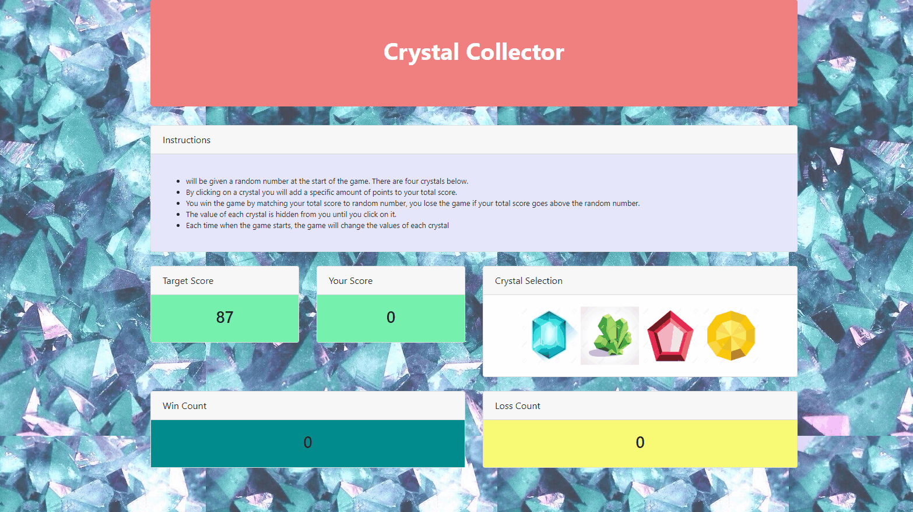

# Crystals-Collector-Game

I created a fun and interactive game for web browsers. My app dynamically updates HTML pages with the jQuery library.


# How the Game is Played:

- There will be four crystals displayed as buttons on the page.

- The player will be shown a random number at the start of the game they have to match.

- When the player clicks on a crystal, it will add a specific amount of points to the player's total score. 

- The game will hide this amount until the player clicks a crystal.

- When they do click a crystal, the app with update the player's score counter.

```
- The player wins if their total score matches the random number from the beginning of the game.

- The player loses if their score goes above the random number.
```

- The game restarts whenever the player wins or loses.

- When the game begins again, the player should see a new random number. Also, all the crystals will have four new hidden values. Of course, the user's score (and score counter) will reset to zero.

You can play the game through this link: https://manofsilva.github.io/Crystals-Collector-Game/

### Demonstration of Application


